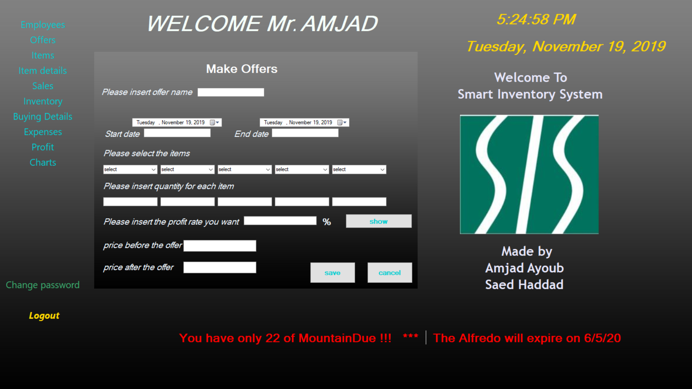
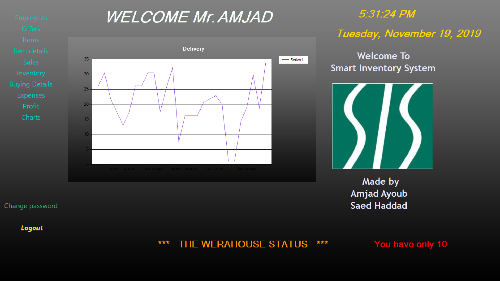

# Smart-Inventory-System
## Overview
The main purpose of this program is to manage restaurants’ inventory. The program uses Artificial Intelligence by taking historical data related to sales, accounting, distribution, and inventory to create forecasting planning related to existing data. Using an efficient programming language C#, the program predicts daily, and yearly patterns and activities to suggest ways to manage the availability of goods, reduce food costs, and gain greater visibility of inventory.

### Screenshots
#### Welcome Page

#### Login Page

#### Cachier Page

#### Discount Button

#### Cash Button

#### Tables Button

#### Make delivery Button

#### Show delivery Button

#### Maps Button

#### Buy Item Button

#### Billings Button

#### Change Password Button

#### Employee Withdrawal Button

#### Manager Page

#### Add Employee Page

#### Edit Employee Page

#### Delete Employee Page

#### View Employee Page

#### Salary Page

#### Suggested Offers Page

#### Select Offer1

#### Make Offer Page

#### Add Item Page

#### Edit Item Page

#### Delete Item Page

#### Buy Item Page

#### View Items Page

#### View Item details Page

#### View Sales Page

#### View Monthly Sales Page

#### View Yearly Sales Page

#### View Sales for an Item Page

#### View Monthly Inventory Page

#### View Yearly Inventory Page

#### View Purchases Page

#### View Purchases in a specific period Page

#### Add Expenses Page

#### View Expenses Page

#### View Monthly Profit Page

#### View Yearly Profit Page

#### View Sales Chart Page

#### View Delivery Chart Page
