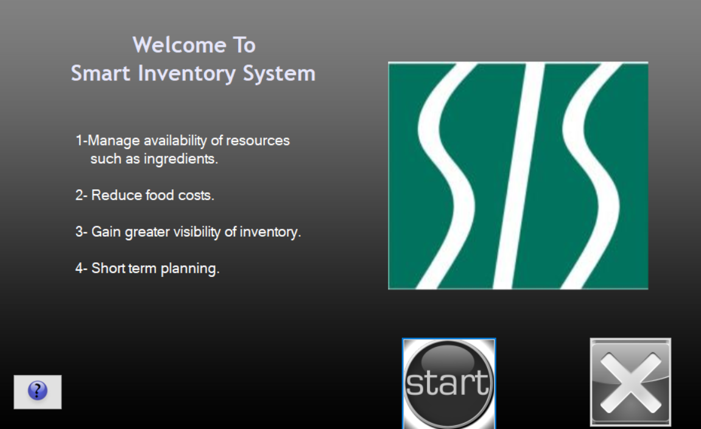
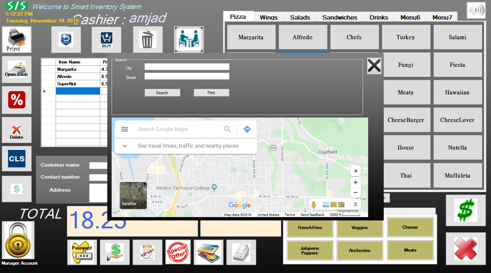
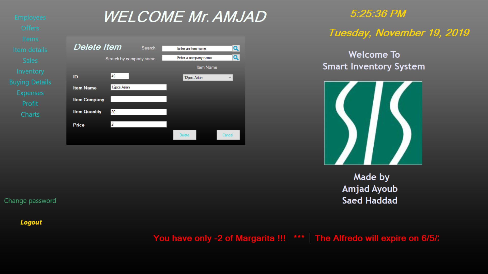
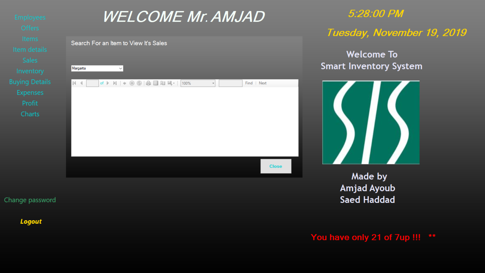

# Smart-Inventory-System

## Overview
***Windows Based Application***, the main purpose of this program is to manage restaurants’ inventory. The program uses Artificial Intelligence by taking historical data related to sales, accounting, distribution, and inventory to create forecasting planning related to existing data. Using an efficient programming language C#, the program predicts daily, and yearly patterns and activities to suggest ways to manage the availability of goods, reduce food costs, and gain greater visibility of inventory.


## Getting Started
These instructions will get you a copy of the project up and running on your local machine for development and testing purposes. They will also give an overview of some of the app's functionality.

### Requirements
You will need Microsoft Visual studio installed if you want to run this application locally. For help installing Microsoft Visual studio, please [click here](https://visualstudio.microsoft.com/thank-you-downloading-visual-studio/?sku=community&rel=16).

### Installing
Git clone the repository to your local machine:

HTTPS:
```
https://github.com/AmjedAyoub/Smart-Inventory-System.git
```
SSH:
```
git@github.com:AmjedAyoub/Smart-Inventory-System.git
```
In the cloned repository, navigate to **"GraduationProjectTest"** folder, and open the ```"GraduationProjectTest.sln"``` file in your visual studio.

You will then be able to start the app locally by running:

```
Ctrl + F5
```

### Screenshots
#### Welcome Page

#### Login Page

#### Cashier Page

#### Discount Button

#### Cash Button

#### Tables Button

#### Make delivery Button

#### Show delivery Button

#### Maps Button

#### Buy Item Button

#### Billings Button

#### Change Password Button

#### Employee Withdrawal Button

#### Manager Page

#### Add Employee Page

#### Edit Employee Page

#### Delete Employee Page

#### View Employee Page

#### Salary Page

#### Suggested Offers Page

#### Select Offer1

#### Make Offer Page

#### Add Item Page

#### Edit Item Page

#### Delete Item Page

#### Buy Item Page

#### View Items Page

#### View Item details Page

#### View Sales Page

#### View Monthly Sales Page

#### View Yearly Sales Page

#### View Sales for an Item Page

#### View Monthly Inventory Page

#### View Yearly Inventory Page

#### View Purchases Page

#### View Purchases in a specific period Page

#### Add Expenses Page

#### View Expenses Page

#### View Monthly Profit Page

#### View Yearly Profit Page

#### View Sales Chart Page

#### View Delivery Chart Page


## Technologies & Tools
* C# programming language  
* MYSQL - MySQL Database
* Microsoft Visual Studio 2015

## Links
This program is published on [GitHub](https://github.com/AmjedAyoub/Smart-Inventory-System).

## Future work
At the moment, this app is the minimum viable product. For future updates; improve the UI/UX, and add more functionality and features such as the ability of managing the data from several restaurants if exists.
